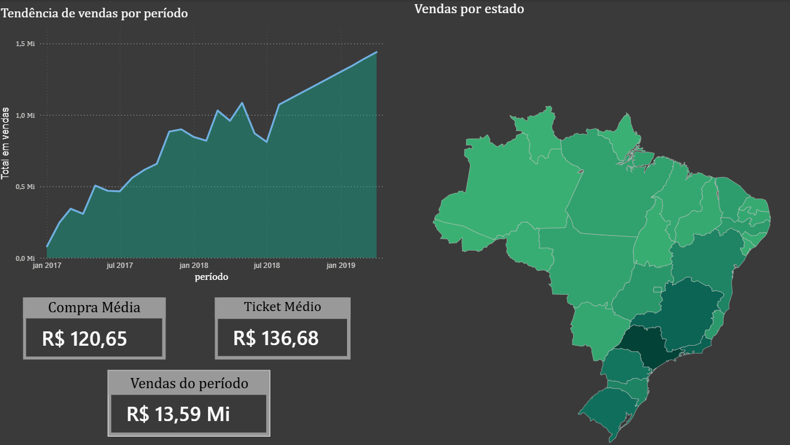
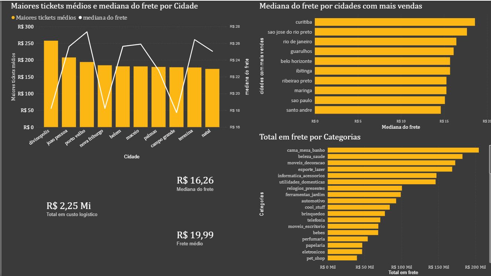
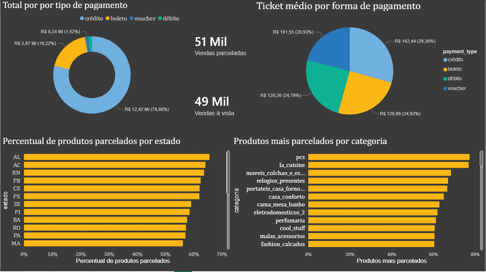
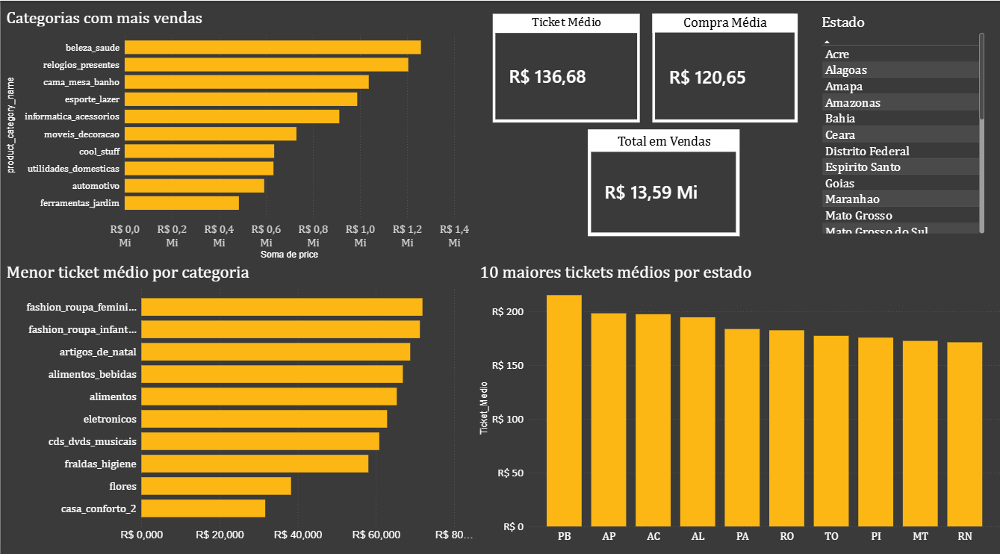

# Análise de Vendas, Custo Logístico e Previsão de Demanda - Olist

Análise exploratória desenvolvida utilizando dados públicos da Olist disponíveis no site Kaggle, com foco em Business Intelligence e análise de dados, implementando conceitos de ETL via Power Query e Pandas e realizando uma previsão de vendas utilizando regressão linear feita em Python com a biblioteca scikit-learn.

## Objetivos

- Analisar indicadores de vendas de marketplace
- Avaliar o setor logístico da empresa
- Identificar padrões de faturamento
- Criar dashboards interativos no Power BI, utilizando variados tipos de gráficos e mapa com divisão de vendas por região
- Desenvolver um modelo de regressão linear em Python para previsão de vendas futuras

## Dashboard Comercial com Previsão e Mapa

## Dashboard Logístico

## Dashboard Financeiro

## Dashboard Comercial

## Tecnologias Utilizadas

- Power BI
- Power Query
- Python
- Pandas
- Scikit-learn

## Como acessar

No repositório estão disponíveis scripts Python usados para a modelagem preditiva e os arquivos .csv tratados para análise e previsão das vendas, além de imagens dos dashboards desenvolvidos.

Como o tamanho do arquivo Power BI está acima dos tamanho permitido pelo GitHub (.pbix), ele foi disponibilizado externamente.

.pbix: https://1drv.ms/u/c/67c291d865ede66a/IQAWU5_GSd1zTqGw2dpeOiPAAfsbE0Jkuc_tR4rFM7WxMH4?e=FkdDX9

Dados crus, disponíveis no Kaggle: https://www.kaggle.com/datasets/olistbr/brazilian-ecommerce

